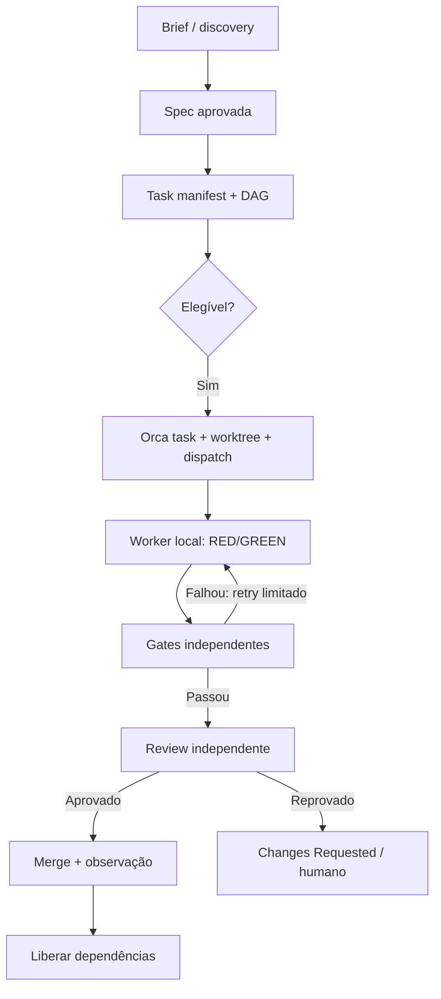

# Executing the Orca Graph Engineering Workflow

## Objetivo

Executar uma primeira onda de tarefas de coding agents com um grafo explícito, loops locais limitados, worktrees isoladas, gates executáveis e review independente. O Orca é o plano de execução; a especificação, o task manifest e os gates continuam sendo a autoridade do workflow.

## Topologia



A dependência entre tarefas deve ser um DAG acíclico. O lifecycle pode conter ciclos controlados, como `Changes Requested → Implementing → Verifying`.

## Artefatos mínimos

A spec tem requisitos e critérios de aceitação estáveis. O manifest é o contrato executável das tarefas. O handoff registra evidência factual. O ledger preserva Run ID, Task ID, Dispatch ID, worktree, branch, base SHA, tentativas, leases, resultados e decisões.

Estrutura mínima:

- `.agent-workflow/specs/CHG-001/spec.md`
- `.agent-workflow/plans/CHG-001/plan.md`
- `.agent-workflow/tasks/CHG-001.yaml`
- `.agent-workflow/handoffs/T-001.md`
- `.agent-workflow/gates/`
- `.agent-workflow/logs/events.jsonl`

## Linear → Orca

Uma Linear Issue não vira automaticamente uma Orca Task só por existir no Linear. A integração atual tem duas superfícies:

- `orca linear` lê a issue, relações, filhos, comentários e estado, e atualiza status/comentários/links;
- `orca orchestration task-create` cria a unidade de execução com spec, título, dependências e Run, mas não recebe `--linear-issue` no contrato atual.

O coordenador deve fazer o mapeamento explícito. Uma issue simples pode gerar uma Task; uma issue ampla pode gerar várias Tasks do DAG:

```yaml
linear_issue: ENG-123
orca_tasks: [T-001, T-002, T-003]
```

Inclua a chave e a URL do Linear no título/spec/ledger da Task. Para o vínculo visual/operacional da worktree, use o campo nativo:

```bash
orca worktree create \
  --repo <repo> \
  --name ENG-123-backend \
  --linear-issue ENG-123 \
  --json
```

Ou atualize uma worktree já criada:

```bash
orca worktree set \
  --worktree <selector> \
  --linear-issue ENG-123 \
  --json
```

Depois, o worker pode ser iniciado nessa worktree existente com `worker-start`. Ao começar, leia a issue com `orca linear issue ENG-123 --full --json`; no fim, anexe PR/MR, publique um comentário factual e mova o status somente depois dos gates e review. `worker_done` não deve marcar a issue como Done.

## Contrato de tarefa

Uma tarefa `Ready` precisa declarar:

- ID e objetivo observável;
- requisito/acceptance IDs relacionados;
- dependências e motivo de cada dependência;
- paths permitidos e proibidos;
- comandos de teste/gate;
- predicted write-set e hotspots compartilhados;
- risco, timeout, retry budget e stop conditions;
- formato do handoff e evidência esperada.

Exemplo:

```yaml
id: T-002
change: CHG-001
title: Implementar endpoint de listagem de tarefas
goal: GET /api/tasks retorna tarefas filtradas por project_id
non_goals:
  - não alterar autenticação
  - não criar uma nova camada de persistência
depends_on: [T-001]
acceptance:
  - id: AC-002
    evidence: test_api_tasks_filtering
allowed_paths:
  - server/routes/tasks.py
  - tests/api/test_tasks.py
forbidden_paths:
  - migrations/
  - infra/
commands:
  - pytest tests/api/test_tasks.py -q
  - pytest tests/api/ -q
write_set: [server/routes/tasks.py, tests/api/test_tasks.py]
risk: low
retry:
  max_attempts: 1
  timeout_minutes: 30
stop_conditions:
  - contrato da API estiver ambíguo
  - teste revelar migração necessária
```

## Passos de execução

### 1. Preflight do Orca

```bash
orca status --json
# Só se o status confirmar runtime indisponível:
orca open --json
orca status --json
orca skills get orca-cli
orca skills get orchestration --full
orca skills get orca-linear
```

Não use `open` por issue/worker e não use `reset` como inicialização. Pare se o runtime estiver indisponível ou a feature de orchestration estiver desabilitada.

### 2. Preparar intenção e especificação

Resolva discovery quando o pedido for ambíguo. Depois produza uma spec aprovada com requisitos, critérios de aceitação, não-objetivos, riscos, decisões abertas e intenção de validação. O executor não pode redefinir a spec.

### 3. Compilar o task DAG

Divida o trabalho em comportamentos verticais observáveis. Valide automaticamente:

- IDs únicos e dependências existentes;
- ausência de ciclos no DAG;
- cada tarefa ligada a acceptance IDs;
- tasks pequenas o bastante para um único executor;
- write-set e API/schema conflicts declarados;
- comandos e stop conditions presentes;
- retry e concurrency budgets definidos.

### 4. Criar a primeira onda

Escolha uma fotografia fixa de tarefas elegíveis. Uma tarefa só pode ser lançada quando:

- `status == ready`;
- todas as dependências estão aceitas/merged na base;
- blockers e decision gates estão resolvidos;
- manifest, spec e gates são válidos;
- não há conflito de write-set;
- os budgets de risco e concorrência permitem o lançamento.

Comece com no máximo dois workers. Não adicione automaticamente uma segunda onda quando um worker terminar.

### 5. Materializar Run, Tasks e Dispatches

Use um Run existente adequado ou crie apenas um:

```bash
orca orchestration run-create \
  --objective "Executar a primeira onda elegível de CHG-001" \
  --json

orca orchestration task-list --json
```

Crie uma Task Orca por unidade elegível e lance um Dispatch por Task. A sintaxe exata de criação de tasks deve vir do guia instalado/versionado; não invente flags.

```bash
orca orchestration worker-start \
  --task <taskId> \
  --worktree new-top-level \
  --repo <exactRepoSelector> \
  --name <issueKey-slug> \
  --agent <registeredWorkerAgent> \
  --setup run \
  --json
```

Para host remoto, acrescente o seletor explícito `--on <exactHostSelector>`. Registre Run ID, task ID, Dispatch ID, repo, host, worktree, branch, base SHA e agente solicitado/observado.

### 6. Executar a tarefa

O worker recebe exatamente um task packet. Para comportamento novo ou bug fix, segue TDD:

1. criar teste que falha;
2. executar e observar o RED esperado;
3. implementar o mínimo;
4. executar GREEN e regressão relevante;
5. refatorar somente com testes verdes;
6. produzir handoff factual;
7. parar em `Review`, `Blocked` ou `Escalation`.

O worker não escolhe outra tarefa, não muda a spec, não faz merge e não se autoaprova.

### 7. Monitorar e reconciliar

```bash
orca orchestration check \
  --wait \
  --types worker_done,escalation,question \
  --timeout-ms 900000 \
  --json
```

Valide `taskId` e `dispatchId` em cada delivery. Acknowledge deliveries com `--ack`. Perguntas bloqueantes devem passar pelo canal observável do Orca. `worker_done` é evidência de entrega, não aceitação de engenharia.

### 8. Executar gates independentes

Rode, conforme o projeto:

- schema/manifest e dependências;
- diff e allowlist/denylist de paths;
- focused test e suíte de regressão;
- formatter, lint, typecheck e build;
- dependências, lockfiles e migrations;
- secret scan e security checks;
- evidência rastreável para cada acceptance ID.

Se o commit mudar, invalide gates e reviews anteriores e execute novamente na nova cabeça.

### 9. Review, merge e próxima onda

Faça review independente de spec compliance, risco de código e segurança quando aplicável. Antes do merge, revalide contra a branch principal atual, confirme CI e políticas de merge e aplique aprovação humana no piloto. Só após merge e observação pós-merge a tarefa vira `Done` e suas dependências são liberadas.

## Exemplo de DAG

Para uma feature de listagem de tarefas:

- `T-001`: contrato/API e critérios — primeira tarefa;
- `T-002`: endpoint backend + testes — depende de `T-001`;
- `T-003`: tela frontend usando o contrato — depende de `T-001`;
- `T-004`: teste integrado — depende de `T-002` e `T-003`.

`T-002` e `T-003` podem formar a primeira onda paralela apenas se seus write-sets não conflitarem. `T-004` não é elegível até que os dois pais estejam aceitos/merged.

## Definition of Done

Uma task só está concluída quando:

1. acceptance criteria têm evidência;
2. gates automáticos passaram;
3. escopo e políticas foram respeitados;
4. review independente passou;
5. handoff está completo;
6. branch/commit, Orca e tracker estão consistentes;
7. a validação pós-merge relevante passou.

## Piloto recomendado

Comece manual/supervisionado com um repositório, dois ou três tasks de baixo risco, no máximo dois workers, worktrees explícitas, gates nativos do projeto, review separado e merge humano. Só adicione dispatcher automático, leases/heartbeat, roteamento por modelo, auto-remediation ou maior concorrência depois de cinco a dez tarefas observadas.

Relacionado: [[entities/tools/orca]], [[coding/architecture/merge-gated-dag-coding-workflow]], [[comparisons/loop-engineering-vs-graph-engineering]].
