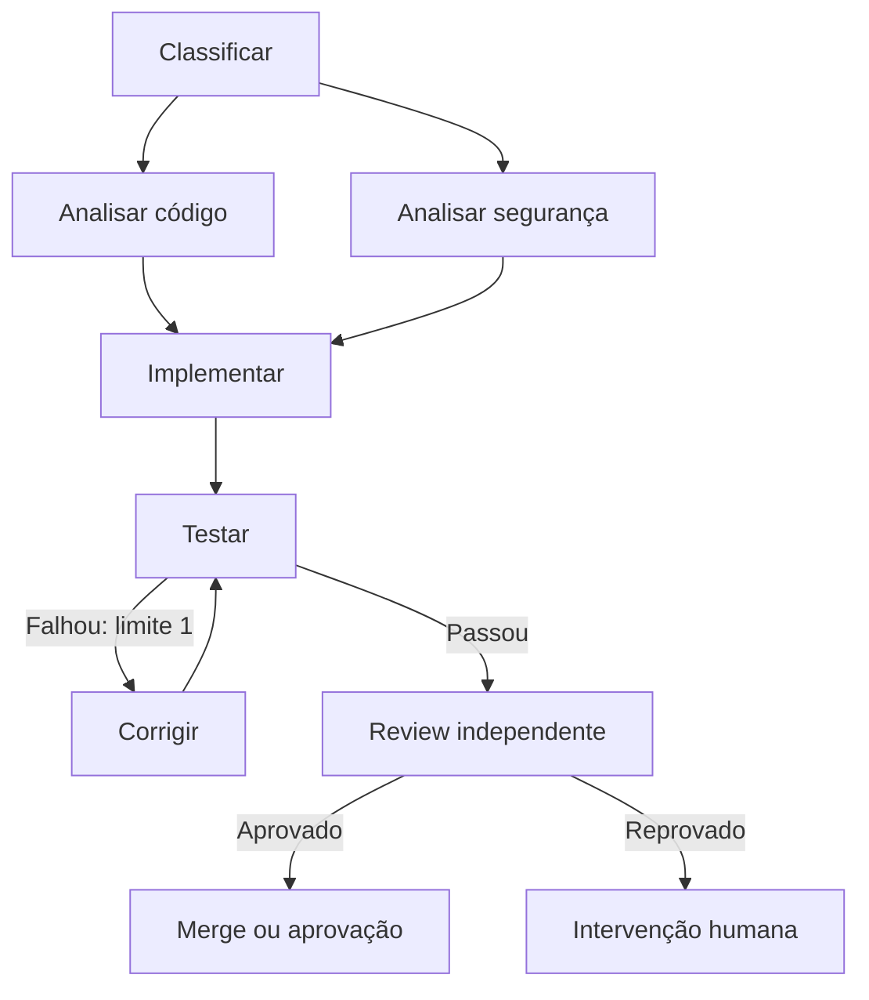

# Loop Engineering vs Graph Engineering

## Status do conceito

“Loop Engineering” e “Graph Engineering” são rótulos recentes usados por praticantes de agentes, não padrões formais com uma definição única. A distinção útil é entre projetar o ciclo de trabalho de um agente e projetar a topologia completa do workflow que coordena agentes, código, ferramentas, verificadores e humanos.

A maior parte da técnica por trás de “Graph Engineering” já aparece em sistemas conhecidos como state machines, DAGs, workflow orchestration e directed graph execution. LangGraph, AutoGen GraphFlow e os workflow agents do Google ADK documentam capacidades equivalentes, embora com APIs e abstrações diferentes.

## Loop Engineering

Loop Engineering projeta um ciclo autônomo de execução:

`trigger → contexto → agir → verificar → atualizar estado → repetir ou parar`

O foco é substituir a interação manual de prompt–resposta por um sistema que encontra trabalho, chama o agente, verifica o resultado, persiste o estado e decide se deve continuar. O loop normalmente inclui limites de iteração, orçamento de tokens, timeout, detecção de falta de progresso e uma condição de saída.

Exemplo de coding loop:

`implementar → executar testes → corrigir → executar testes → finalizar`

### Benefícios

- reduz o trabalho de ficar “babysitting” o agente;
- torna a execução repetível e automatizável;
- cria feedback objetivo quando há testes, lint, schemas ou outros gates;
- permite rodar tarefas agendadas ou orientadas a eventos;
- pode preservar estado e retomar trabalhos longos;
- funciona muito bem para tarefas de domínio único e objetivo verificável.

### Limitações

- pode repetir a estratégia inteira quando apenas uma parte falhou;
- pode entrar em retry infinito ou gastar tokens sem progresso;
- tende a esconder decisões de roteamento dentro do agente;
- é menos natural para fan-out/fan-in, dependências entre tarefas, aprovações e múltiplos especialistas;
- um agente pode continuar confiante mesmo quando o verificador é fraco.

## Graph Engineering

Graph Engineering explicita o workflow como um grafo de nós e arestas.

- **Nó:** agente, função normal, ferramenta, teste, gate, armazenamento ou aprovação humana.
- **Aresta:** dependência, ordem de execução ou rota condicional.
- **Estado:** dados e artefatos transmitidos entre nós.
- **Fan-out/fan-in:** abrir tarefas independentes em paralelo e depois consolidar os resultados.
- **Ciclo:** uma aresta que retorna a um nó anterior; portanto, loops continuam existindo dentro do grafo.

Exemplo:



### Benefícios

- torna dependências e responsabilidades explícitas;
- permite rotear cada caso para o agente, modelo ou ferramenta adequada;
- habilita paralelismo real quando as tarefas são independentes;
- repete apenas o ramo ou nó que falhou, em vez de reiniciar tudo;
- facilita observabilidade, auditoria, replay e medição por etapa;
- combina passos determinísticos e probabilísticos no mesmo fluxo;
- permite budgets, timeouts, permissões e critérios de saída por nó;
- cria pontos claros para revisão e escalada humana.

### Limitações

- aumenta a complexidade de orquestração, estado e contratos entre nós;
- um grafo cheio de agentes pode custar mais e ser menos confiável que um loop simples;
- paralelismo exige lidar com conflitos, sincronização e resultados incompatíveis;
- erros de modelagem nas arestas podem gerar caminhos mortos, ciclos ruins ou resultados incompletos;
- “organogramas de agentes” podem virar apenas complexidade estética, sem ganho mensurável.

## Diferença central

| Dimensão | Loop Engineering | Graph Engineering |
|---|---|---|
| Unidade principal | ciclo de execução de um agente/sistema | workflow de nós coordenados |
| Pergunta | “Como continuar até concluir ou desistir?” | “Qual etapa vem agora e por qual caminho?” |
| Estrutura | sequência com retry | sequência, branches, paralelismo, joins e ciclos |
| Verificação | normalmente no ciclo inteiro | pode existir em cada nó ou transição |
| Escopo ideal | tarefa autônoma e bem delimitada | processo heterogêneo, dependente ou multiagente |
| Risco típico | loop infinito e desperdício de tokens | overengineering e coordenação excessiva |

## Relação entre os dois

Graph Engineering não “substitui” Loop Engineering no sentido técnico. Um loop é um ciclo dentro de um grafo. A relação prática mais saudável é:

- o **grafo** controla o processo maior;
- cada nó pode conter um **loop local** pequeno e limitado;
- verificadores determinísticos decidem as transições sempre que possível;
- o sistema interrompe ou escala para um humano quando o orçamento ou a confiança acaba.

Para workflows de coding, a forma recomendada é começar com um grafo mínimo — especificação → tarefa → executor → gates → review — e adicionar paralelismo ou agentes especializados apenas quando houver uma dependência, fronteira de contexto ou ganho de qualidade mensurável. Um loop de correção pode existir apenas dentro do executor, com tentativas limitadas.

O ganho não vem do nome “graph”. Vem de decomposição correta, contratos pequenos, roteamento explícito, verificadores externos, limites rígidos e observabilidade.

## Aplicação ao Orca

O workflow que estamos desenhando se encaixa melhor como **deterministic graph engineering** ou **graph-based agent orchestration**:

```text
brief/spec
  → task DAG
  → tarefas elegíveis
  → Orca dispatch + worktree
  → worker local loop
  → gates executáveis
  → review independente
  → merge
  → liberar dependências seguintes
```

Nesse desenho:

- o **task DAG** representa dependências, conflitos e paralelismo;
- o **dispatcher/coordenador** calcula a antichain elegível a partir do estado, sem pedir ao LLM para adivinhar;
- o **Orca** funciona como cockpit e control plane de execução: tasks, dispatches, worktrees, workers e mensagens;
- cada **worker** pode executar um loop local limitado de implementar → testar → corrigir;
- os **gates** e a revisão independente decidem aceitação, não o `worker_done` nem a opinião do executor;
- Linear pode projetar tickets e contexto, mas não precisa ser a autoridade canônica do estado de execução.

O task DAG deve permanecer acíclico para dependências de implementação. Já o lifecycle graph pode ter ciclos controlados, como `Changes Requested → Implementing → Verifying`, desde que retry, timeout e escalada estejam limitados.

Portanto, o seu trabalho não é simplesmente “colocar vários agentes para conversar”. É uma forma mais rigorosa de Graph Engineering: **especificação, contratos de tarefa, dependências, isolamento, dispatch determinístico, gates, review e merge como transições explícitas**. O loop existe, mas fica contido dentro do executor e não governa o processo inteiro.

## Fontes e relação com ferramentas existentes

- Addy Osmani descreve Loop Engineering como projetar o sistema que chama, verifica e alimenta agentes em vez de fazer cada prompt manualmente.
- A documentação do LangGraph o apresenta como runtime de orquestração para agentes stateful e long-running, misturando passos determinísticos e orientados por LLM, com execução durável e human-in-the-loop.
- O AutoGen GraphFlow documenta execução dirigida por grafo, com cadeias sequenciais, fan-out paralelo, branching condicional e loops com condições seguras de saída.
- O Google ADK documenta workflows compostos por agentes e controle estruturado de execução.

Relacionado: [[coding/architecture/merge-gated-dag-coding-workflow]], [[coding/architecture/kitdev-deterministic-agentic-workflows]], [[entities/tools/hermes-agent]].
